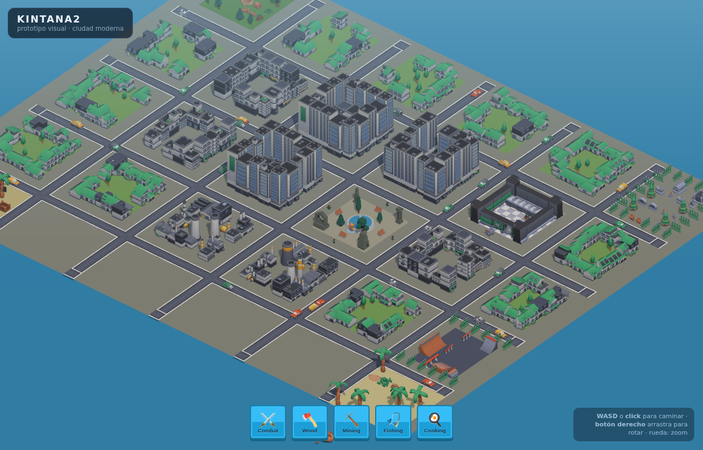
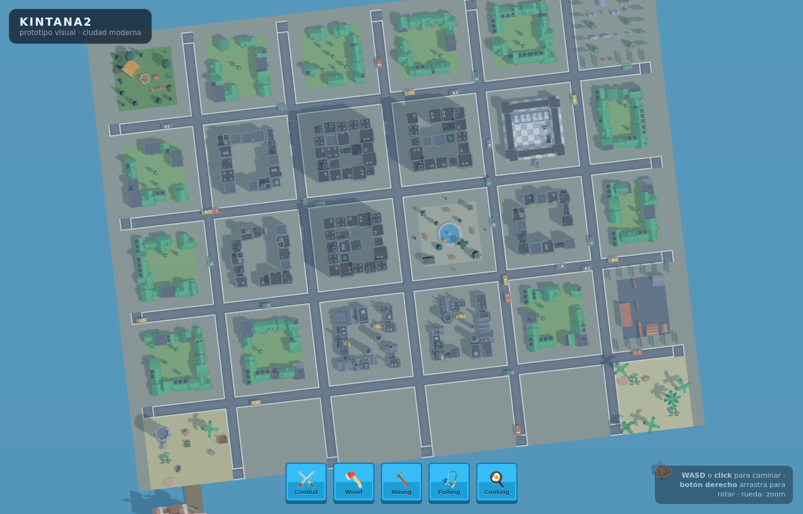

# KINTANA2

MMO isométrico low-poly en el navegador (prototipo visual). Ciudad moderna
low-poly con cámara isométrica tipo Kintara, construida con **Three.js +
Vite**. Assets: pack CC0 de Kenney.

> Fase actual: **solo la parte gráfica/visual del mundo.** Backend, economía
> y token vienen después. Ver `CLAUDE.md` para el plan completo y `ASSETS.md`
> para el inventario de assets.



## Diseño urbano

La ciudad **no se genera amontonando assets**: se construye en orden
urbanístico (límites → red vial → distritos → manzanas → parques →
comercio → residencial → industria → especiales → decoración → vegetación).
El plano define distritos con función clara y transiciones lógicas.



Distritos (isla de 34×34 tiles):
- **Centro**: downtown de rascacielos + **plaza central con fuente**.
- **Comercial**: sobre las avenidas, alrededor del centro.
- **Residencial**: casas agrupadas en la periferia (N/E/O), con jardines.
- **Parque** y **skatepark** al norte; **feria/mercado** al este.
- **Industria** al sur, junto al **puerto** (lógica logística).
- **Cementerio** en la periferia noreste.

## Qué hay hasta ahora

- **Movimiento**: **WASD/flechas** (relativo a cámara) **y click** para
  caminar (A* que esquiva edificios). La cámara rota con **botón derecho**
  (no interfiere con el click) y **sigue al jugador con zona muerta**.
- **Edificios que tapan al jugador se transparentan** (occlusion fade), para
  no perder de vista al personaje.
- **Red vial** con autotiling correcto + **veredas** (calles más anchas).
- **Zonas con diseño ordenado**: residencial en hileras, plaza simétrica
  (fuente + estatuas + bancos + flores), skatepark con layout fijo,
  cementerio en hileras, **minimarket al que se entra** (paredes, puerta,
  ventanilla/caja, góndolas, heladeras, empleado).
- **Nuevas zonas**: **bosque** con campamento (Nature + Survival),
  **caleta pirata** y **playa** en la costa (Pirate Kit).
- **Tráfico**: autos por la grilla y **todos los barcos/botes en movimiento**.
- **Escala coherente**; suelo urbano (pasto sólo en verde real).
- Personaje **animado** (idle/walk) desde el rig de Kenney.
- **HUD** con assets UI de Kenney.

Assets 3D en `public/assets/` (todo CC0 de Kenney): `city/`, `characters/`,
`market/`, `skate/`, `graveyard/`, `port/`, `nature/`, `pirate/`,
`survival/`, `ui/`.

## Correr en local

```bash
npm install
npm run dev      # servidor de desarrollo (http://localhost:5173)
```

Build de producción:

```bash
npm run build    # genera dist/
npm run preview  # sirve dist/ para probar el build
```

## Deploy en Render (Static Site)

El proyecto es un sitio estático: Render lo compila con Vite y sirve la
carpeta `dist/`.

### Opción A — desde el dashboard de Render (recomendado)

1. Entrá a <https://dashboard.render.com> → **New +** → **Static Site**.
2. Conectá tu cuenta de GitHub y elegí el repo **`kintana2`**.
3. Configurá:
   - **Branch**: `main` (o la que quieras desplegar).
   - **Build Command**: `npm install && npm run build`
   - **Publish Directory**: `dist`
   - **Node Version**: 18 o superior (Render usa 20 por defecto; ok).
4. **Create Static Site**. Render clona, corre el build y publica en una URL
   `https://kintana2.onrender.com` (o similar). Cada push a esa branch
   redeploya solo.

> No hacen falta variables de entorno para el prototipo.

### Opción B — Infrastructure as Code (`render.yaml`)

Ya dejé un `render.yaml` en la raíz. Con **Blueprints** de Render
(**New + → Blueprint**), Render lee ese archivo y crea el static site con la
config correcta automáticamente. Solo tenés que apuntarlo al repo.

### Notas

- El bundle JS incluye Three.js (~590 KB, ~150 KB gzip). Para el prototipo
  está bien; más adelante se puede optimizar (code-splitting, comprimir GLB).
- `dist/` y `node_modules/` están gitignoreados: Render los regenera.
- SPA de una sola ruta; no hace falta configurar rewrites.

## Estructura

```
kintana2/
├─ index.html          # entry + overlay de carga + HUD
├─ src/
│  ├─ main.js          # escena, cámara iso, isla+puerto procedural, personaje
│  ├─ assets.js        # manifiesto de modelos GLB por categoría
│  └─ style.css        # estilos del HUD/loader
├─ public/assets/
│  ├─ city/ characters/ market/ skate/ graveyard/ port/ ui/
├─ render.yaml         # config de deploy en Render
├─ vite.config.js
├─ ASSETS.md           # inventario del pack Kenney + recomendación
└─ CLAUDE.md           # guía del proyecto y fases
```

## Próximos pasos (según CLAUDE.md)

- Barrio **medieval** como distrito aparte (Fantasy Town Kit + Castle Kit).
- **Naturaleza** dedicada (Nature Kit) para fuente/gathering.
- Animaciones extra del rig (correr, pescar, minar, combate) por skill.
- Recursos y herramientas (hacha, pico, caña) sobre el mundo.
